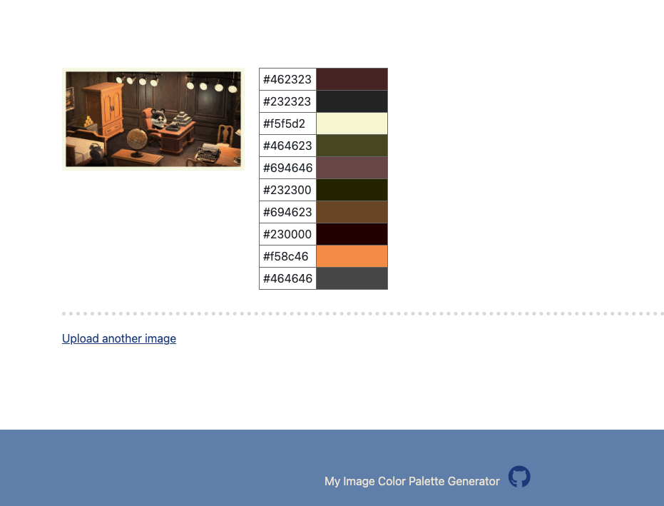

# py10_ImageColorPaletteGenerator

This web application project is a homework for *100 Days of Code: The Complete Python Pro Bootcamp for 2022.*

*  A website where a user can upload an image then returns the top 10 most common colours in that image.

### Reference

* [Image Color Extract Tool (demo and code) - Cool PHP Tools](http://www.coolphptools.com/color_extract#demo)
* [Converting an RGB color tuple to a hexidecimal string - Stack Overflow](https://stackoverflow.com/questions/3380726/converting-an-rgb-color-tuple-to-a-hexidecimal-string)
* [Delete an uploaded file after downloading it from Flask - Stack Overflow](https://stackoverflow.com/questions/24612366/delete-an-uploaded-file-after-downloading-it-from-flask)
* [Uploading Files — Flask Documentation (2.1.x)](https://flask.palletsprojects.com/en/2.1.x/patterns/fileuploads/)
* [Advanced Python Scheduler — APScheduler 3.9.0 documentation](https://apscheduler.readthedocs.io/en/3.x/)

